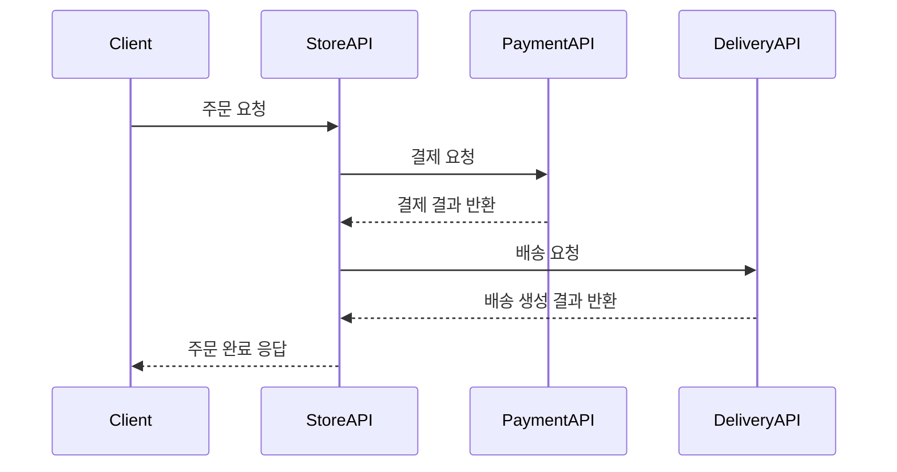

<br/>

# CommerceFlow

주문, 결제, 배송 흐름을 멀티모듈로 분리해 설계한 Kotlin/Spring Boot 백엔드 프로젝트입니다.

현재는 `store-api`를 중심으로 인증과 상품 기능을 구현했고, `payment-api`, `delivery-api`는 이후 서비스 분리를 염두에 둔 실행 골격을 구성했습니다.  
하나의 큰 애플리케이션으로 시작하지 않고, 주문 처리 도메인을 역할별로 나누어 설계하는 과정을 학습하고 검증하는 데 초점을 맞췄습니다.

## 프로젝트 목표

- 주문 처리 시스템을 역할별 서비스로 분리해 설계하는 경험 축적
- 인증, 상품 관리, 페이징 조회, 테스트 코드 등 운영형 백엔드 기본기 정리
- 추후 결제/배송 서비스로 확장 가능한 구조 실험
- Kotlin + Spring Boot 기반 멀티모듈 구성 경험 확보

## 현재 구현 범위

### store-api
- 회원가입 / 로그인 기능
- JWT 기반 인증 처리
- 상품 등록
- 상품 목록 조회
- 상품 상세 조회
- QueryDSL 기반 조회 로직 구성
- 예외 처리 및 Swagger 설정

### payment-api
- 결제 서비스 분리를 위한 애플리케이션 골격 구성
- 독립 실행 포트 및 기본 환경 설정

### delivery-api
- 배송 서비스 분리를 위한 애플리케이션 골격 구성
- 독립 실행 포트 및 기본 환경 설정

## 아키텍처

이 프로젝트는 멀티모듈 기반으로 구성되어 있으며, 각 모듈은 독립 실행 가능한 서비스 형태를 가정하고 설계했습니다.

- `store-api`: 인증 및 상품 관리 담당
- `payment-api`: 결제 도메인 확장 예정
- `delivery-api`: 배송 도메인 확장 예정

`store-api` 내부는 `adapter / application / domain` 구조를 중심으로 나누어 관심사를 분리했습니다.  
컨트롤러, 서비스, 도메인, 영속성 계층을 구분해 유지보수성과 테스트 용이성을 높이려 했습니다.

## 주문 처리 흐름

현재 레포의 설계 목표는 아래와 같은 흐름입니다.



현재 구현은 `store-api` 중심이며, `payment-api`, `delivery-api`는 이후 확장을 위한 준비 단계입니다.

## 기술 스택

- Language: Kotlin 1.9.25, Java 17
- Framework: Spring Boot 3.4.1
- Database: H2
- ORM: Spring Data JPA, QueryDSL
- Auth: JWT
- API Docs: Springdoc OpenAPI
- Test: Kotest, MockK, RestAssured

## 프로젝트 구조

```text
order-process
├─ store-api
│  ├─ auth
│  ├─ product
│  └─ global
├─ payment-api
└─ delivery-api
```

## 실행 방법

### 1. store-api 실행
```bash
./gradlew :store-api:bootRun
```

- Port: `8080`
- Context Path: `/api`

### 2. payment-api 실행
```bash
./gradlew :payment-api:bootRun
```

- Port: `8081`
- Context Path: `/api`

### 3. delivery-api 실행
```bash
./gradlew :delivery-api:bootRun
```

- Port: `8082`
- Context Path: `/api`

## 주요 엔드포인트

### 인증
- 회원가입
- 로그인

### 상품
- `POST /api/products`
- `GET /api/products?offset=0&limit=20`
- `GET /api/products/{productId}`

## 테스트

`store-api` 기준으로 아래 테스트를 작성했습니다.

- 인증 인수 테스트
- 인증 서비스 테스트
- 상품 컨트롤러 테스트
- 상품 서비스 테스트

실행:
```bash
./gradlew test
```

## 설계하면서 신경 쓴 점

- 인증과 상품 기능을 먼저 구현하고, 이후 결제/배송을 분리할 수 있도록 모듈 구조를 나눴습니다.
- 조회 성능과 유지보수성을 고려해 QueryDSL 기반 조회 구조를 적용했습니다.
- 테스트 코드와 예외 처리 구조를 함께 가져가며 단순 기능 구현에 그치지 않도록 구성했습니다.
- 처음부터 완전한 MSA를 만드는 것보다, 분리 가능한 경계를 먼저 잡는 데 집중했습니다.

## 개선 예정

- 결제 도메인 실제 구현
- 배송 도메인 실제 구현
- 주문 엔티티 및 주문 상태 관리
- 서비스 간 통신 방식 구체화
- Docker 및 로컬 통합 실행 환경 구성
- MySQL/PostgreSQL 기반 실행 환경 추가
- 비동기 이벤트 처리 도입

## 회고

이 프로젝트는 주문, 결제, 배송을 한 번에 모두 구현하는 것보다, 도메인 경계를 어떻게 나누고 어떤 순서로 확장할지 고민하는 데 의미가 있었습니다.  
현재는 `store-api` 중심으로 기능이 구현되어 있지만, 이후 `payment-api`, `delivery-api`를 실제 비즈니스 흐름으로 연결하면서 서비스 분리와 데이터 정합성 문제를 더 깊게 다룰 계획입니다.
```
